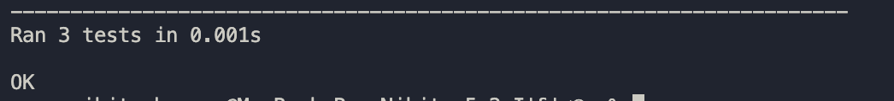

### Установка зависимотстей

Скачайте Graphviz с официального сайта

```bash
python -m venv venv
```

```bash
source venv/bin/activate
```

```bash
pip install graphviz
```


### Информация о ключах командной строки
```
python main.py -h
```

### Запуск визуализатор графа зависимостей
```
python main.py --graphviz-path "dot" --package-name "com.google.guava" --max-depth 2 --repo-url "https://github.com/google/guava.git"
```

### Тестирование с заготовленным репозиторием
```
python -m unittest test
```

